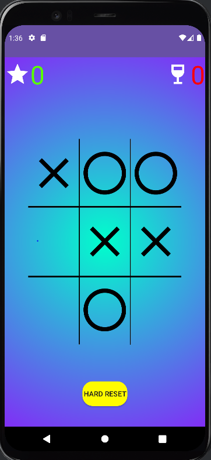
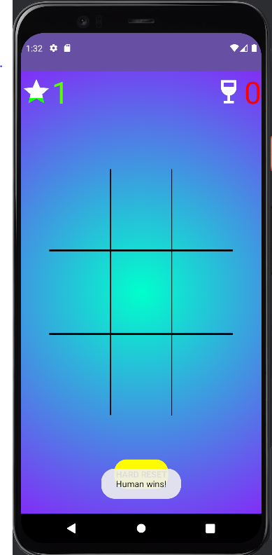
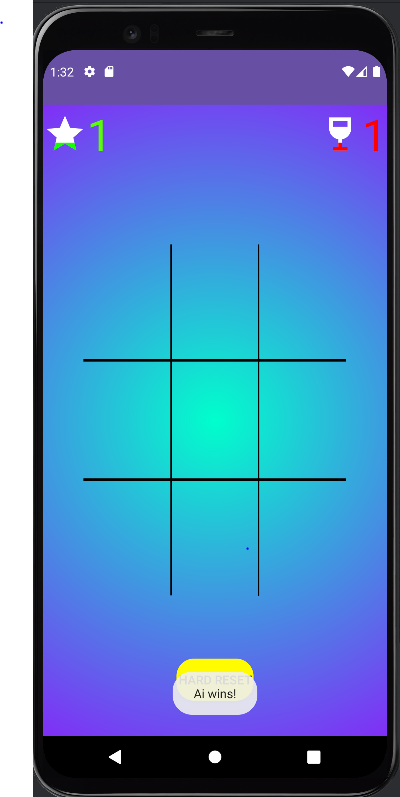
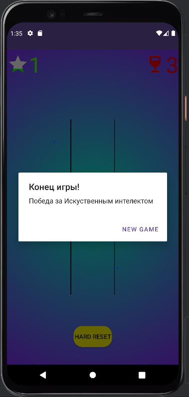

# android-course-Drawables
Task from android dev course

# Разработать игру «Крестики-Нолики». 
Поле 3 на 3. С простейшим искусственным интеллектом (AI). Подсчет и отображение выигранных раундов для игрока и AI. Игра идет до 3-х выигранных раундов, после трёх скидывается в 0. Красным бокал –количество побед робота. От белого до красного. Белая звезда –количество побед человека
# Требования
- 1 или более Bitmapfile(.png,.jpg, .gif или.webp)
- 1 или более VectorDrawable
- 1 или более ShapeDrawable(<shape>)
- 1 или более ClipDrawable(<clip>)
- 1 или более Statelist(<selector>)
- 1 или болееLayer list (<layer-list>)

# Implementation screenshots

